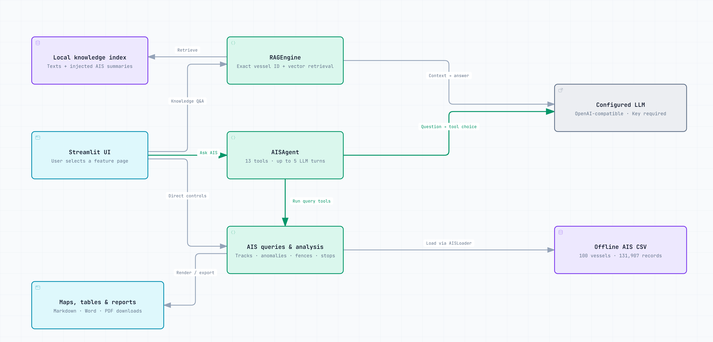
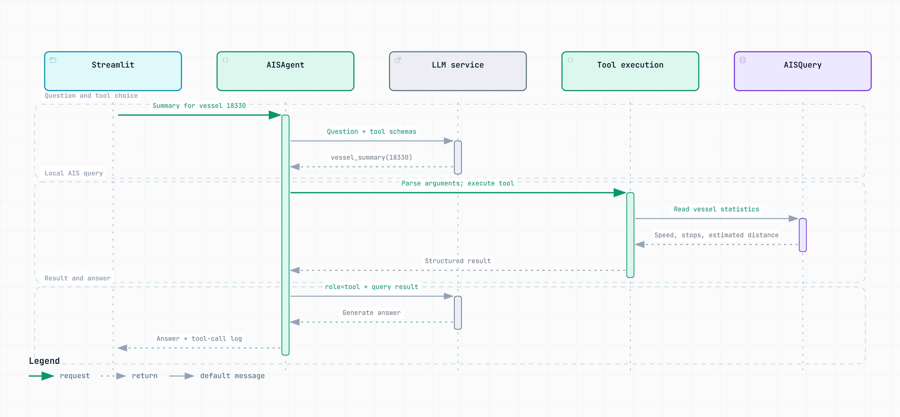

# Maritime VTS Knowledge Agent

**English** | [简体中文](README.zh-CN.md)

Explore vessel tracks, query AIS data with an LLM, and retrieve maritime knowledge in one Streamlit demo.

Built around **100 vessels and 131,907 CSV records**, this project connects local AIS analysis with a maritime knowledge base and an Agent that can call data tools. It is a learning and research prototype for Vessel Traffic Service (VTS) scenarios.

## Choose a starting point

| What you want to do | Where to start in the Chinese UI | What it provides | LLM API key |
|---|---|---|---|
| Inspect tracks or detect events | AIS 轨迹分析 | Maps, speed anomalies, geofences, stops and voyages | Not required for analysis |
| Ask about a vessel or month | AIS 轨迹分析 → 自然语言查询 | Text answer with an expandable tool-call log | Required |
| Ask about VTS, AIS or maritime concepts | 海事知识库问答 | Retrieved passages, with optional LLM generation | Optional for retrieval |
| Compile a monthly activity report | AIS 轨迹分析 → 月度报告 | Monthly statistics and Markdown / Word / PDF downloads | Not required |

## How the parts fit together

Users select a page. RAG, natural-language AIS queries and direct analysis follow separate paths through the application.

<a href="docs/assets/overview.en.png">
<picture>
  <source media="(prefers-color-scheme: dark)" srcset="docs/assets/overview.en.dark.png">
  
</picture>
</a>

*Click the diagram to view full size.*

- **RAG:** maritime text and optionally injected vessel summaries → exact vessel-ID recall plus cosine retrieval → source passages and, with a key, an LLM answer.
- **AIS Agent:** question → LLM tool selection → local query or analysis → tool result returned to the model → answer and tool log.
- **Direct analysis:** page controls → local computations → maps and tables. The report page assembles monthly results and offers document exports.

The CSV data and vector index are local. With an LLM configured, questions, retrieved passages and tool results can be sent to that service. Map basemaps use external tile services.

## Follow one vessel question

After configuring an LLM, open **AIS 轨迹分析 → 自然语言查询** and select:

```text
船 18330 的统计摘要
```

This asks for the statistical summary of vessel `18330`. One representative route is `vessel_summary` with `{"vessel_id": 18330}`. The model selects the tool; the following sequence is derived from the source, not an actual API trace.

<a href="docs/assets/agent-query.en.png">
<picture>
  <source media="(prefers-color-scheme: dark)" srcset="docs/assets/agent-query.en.dark.png">
  
</picture>
</a>

*Click the diagram to view full size.*

Expand **查看 AI 调用的工具** to inspect the chosen tool, its arguments and a preview of its result. Maps and full document downloads live on the separate analysis pages.

The Agent registers **13 tools, including `direct_answer`**, and permits at most five LLM turns. If the first response contains no tool call, it adds one retry prompt. Later text can still be returned without a data-tool call, so the tool log matters when checking numerical claims.

## Quick start

Use Python 3.10+ and a virtual environment. An ASCII-only project or model-cache path is recommended on Windows.

```text
git clone https://github.com/NaCr05/maritime-vts-agent.git
cd maritime-vts-agent
python -m venv .venv
```

<details>
<summary>Windows PowerShell</summary>

```powershell
.\.venv\Scripts\Activate.ps1
python -m pip install -r requirements.txt
Copy-Item .env.example .env
```

</details>

<details>
<summary>macOS / Linux</summary>

```bash
source .venv/bin/activate
python -m pip install -r requirements.txt
cp .env.example .env
```

</details>

For AI generation and natural-language AIS queries, fill in `.env` using the settings in [.env.example](.env.example):

```dotenv
LLM_API_KEY=your-api-key
LLM_BASE_URL=https://api.deepseek.com/v1
LLM_MODEL=deepseek-chat
EMBEDDING_MODEL=paraphrase-multilingual-MiniLM-L12-v2
```

Leave `LLM_API_KEY` empty to use direct AIS analysis after initialization. The natural-language Agent does not provide a keyword-query fallback without a key.

```text
streamlit run app.py
```

The default local address is `http://localhost:8501`. The current startup path also initializes the embedding model before rendering any page: first use can require a model download even when no LLM key is configured. Set `VTS_HF_CACHE_DIR` if a writable model-cache location is needed. Restart Streamlit after editing `.env`.

For a first direct-analysis example, select **AIS 轨迹分析 → 轨迹地图可视化** and vessel `18330`. The repository's [demo checklist](docs/demo_checklist.md) contains further scenarios; its checkboxes are procedures, not evidence that the current checkout passed them.

## RAG and analysis details

The knowledge base uses `sentence-transformers` on CPU and an in-memory vector index. The sidebar action **注入 AIS 数据到知识库** writes vessel summaries to `data/ais_knowledge/` and rebuilds the index. These are generated snapshots; live AIS is not connected.

RAG merges exact vessel-ID matches with vector results. With nonempty results, maritime keywords, a known vessel ID, or the similarity threshold can select the RAG path. Otherwise, the LLM answer is labeled as general knowledge. Without a key, the RAG engine returns retrieved passages when relevant results are found.

| Analysis | Approach | Source |
|---|---|---|
| Speed anomalies | Z-score with stop-segment handling | [speed_anomaly.py](src/speed_anomaly.py) |
| Restricted zones | Rectangular and circular geofences | [geo_fence.py](src/geo_fence.py) |
| Anchorage / stop clusters | DBSCAN with Haversine distance | [stay_point_detection.py](src/stay_point_detection.py) |
| Voyages | Boundaries from sustained low-speed periods | [voyage_segmentation.py](src/voyage_segmentation.py) |

## Read the code

| Area | Entry points |
|---|---|
| Navigation and initialization | [app.py](app.py), [ui/ais_analysis_page.py](ui/ais_analysis_page.py) |
| LLM tool loop | [src/ais_agent.py](src/ais_agent.py) |
| RAG and local retrieval | [src/rag_engine.py](src/rag_engine.py), [src/vector_store.py](src/vector_store.py) |
| AIS data and statistics | [src/ais_loader.py](src/ais_loader.py), [src/ais_query.py](src/ais_query.py) |
| Report assembly and export | [ui/report_page.py](ui/report_page.py), [src/report_exporter.py](src/report_exporter.py) |

## Data and scope

The bundled 100 CSV files contain vessel IDs `18330–18429` and **131,907 records**, spanning **2016-11-01 to 2020-11-01**. These counts were calculated from the files at revision `92312c4`.

The loader normalizes vessel ID, latitude, longitude, speed over ground, course over ground and timestamp columns. If the dataset changes, refresh its summary with `python -m src.scan_dataset`.

## Tests

[Six automated regression cases](docs/testing.md) cover RAG navigation and no-key answers, monthly-report and geofence entry points, real monthly calculations and Markdown / Word / PDF outputs, and the no-key Agent message. They use bundled AIS data and real exporters with deterministic retrieval in place of the embedding model.

```text
python -m pip install -r requirements-test.txt
python -m pytest tests -q
```

These checks do not validate live LLM responses, embedding quality or first-time model downloads. See [diagram sources and regeneration](docs/diagrams/README.md) to maintain the figures.

## Current limitations

- No real-time AIS ingestion, multi-agent orchestration or quantitative answer-quality evaluation is included.
- Risk scores, geofences and anomaly settings are demo rules. They are not operational maritime decisions.

## License

The code uses the [MIT License](LICENSE). Bundled AIS data and maritime text excerpts are provided for learning, research and demonstration; their original providers' terms still govern reuse.
