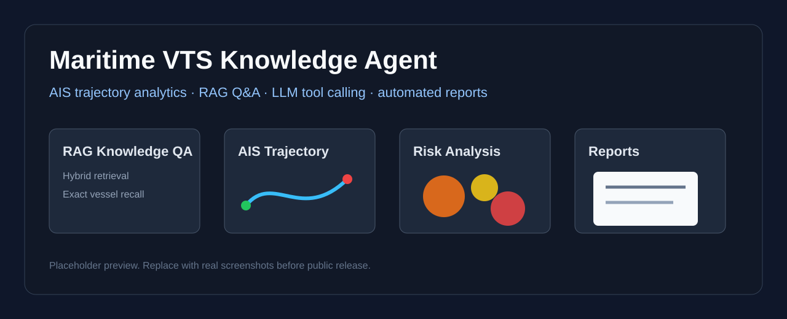
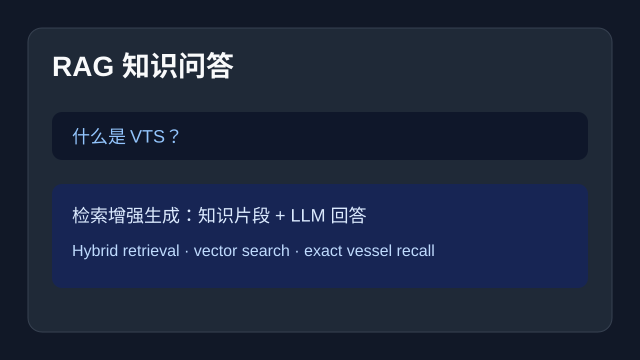
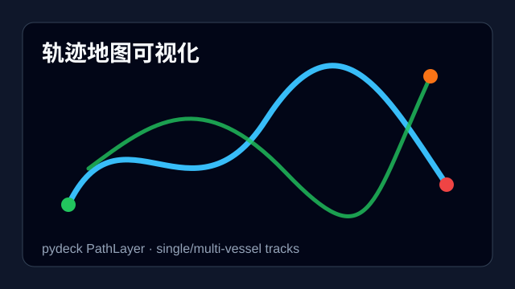
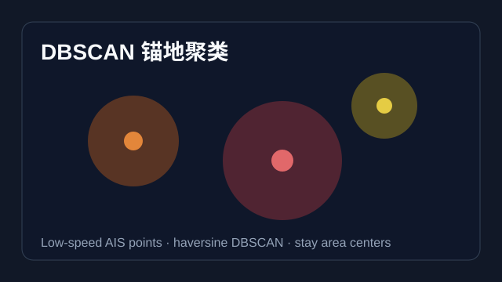
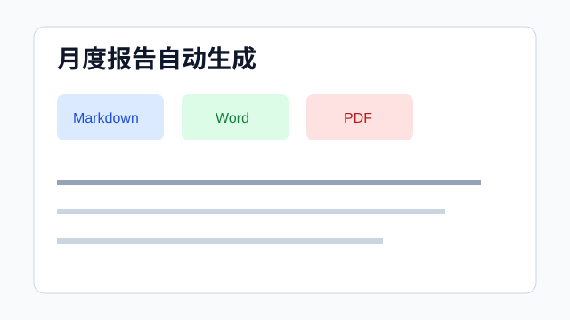
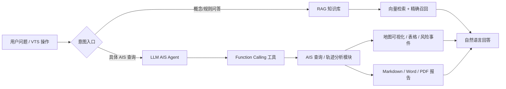

# Maritime VTS Knowledge Agent ⚓

一个面向海事 **VTS（Vessel Traffic Service，船舶交通服务）** 场景的 **AIS 轨迹分析与 RAG 智能体 Demo**，支持轨迹可视化、异常检测、地理围栏、停泊聚类、自然语言查询与自动报告生成。

> 副标题用一句白话说：**让 AI 当 VTS 值班员的副手，把重复的信息检索和报告工作自动化掉。**

---

## 🖼️ 功能预览

> 下面的图片位于 `docs/assets/`。当前仓库先提供占位预览图；正式发布前建议替换为真实运行截图和 20 秒 GIF。



| RAG 知识问答 | 轨迹地图可视化 |
|---|---|
|  |  |

| 锚地聚类 | 月度报告导出 |
|---|---|
|  |  |

### 系统架构



---

## ✨ 项目亮点

- 🧠 **海事知识库 RAG**：内置 IMO / IALA / AIS / 风险规则等文档，`paraphrase-multilingual-MiniLM-L12-v2` 做 embedding，支持 hybrid 检索（关键词兜底 + 数字船号精确召回 + 相似度阈值）。
- 🤖 **LLM Function Calling**：注册了 13 个 AIS 数据查询工具，让 LLM 自动决定调哪个工具来回答用户问题（不是关键词匹配）。
- 🛰️ **AIS 轨迹分析**：100 艘渔船 / 约 13 万个轨迹点，支持单船回放、多船对比、航速异常检测（Z-Score）、锚地聚类（DBSCAN）、航次识别等。
- 🛡️ **地理围栏**：矩形 + 圆形禁航区检测，违例段在地图上以红色高亮；支持自定义测试区域。
- 📄 **月度报告自动生成**：选定月份 + 可选纳入异常 / 围栏违例，一键导出 Markdown / Word / PDF。
- 📊 **可视化**：pydeck 提供高质量轨迹图、热力图、围栏高亮（多底图风格：深色 / 浅色 / 道路 / 卫星）。
- 🪟 **Windows 中文路径兼容**：自己 patch 了 tqdm 和 stderr，HF 缓存强制走 ASCII 路径，不会在中文项目路径下崩溃。

---

## 📦 项目结构

```
maritime-vts-agent/
├── app.py                          # Streamlit 入口、全局初始化与主导航
├── ui/
│   ├── rag_page.py                 # 海事知识库 RAG 问答页面
│   ├── ais_analysis_page.py        # AIS 分析子导航配置
│   ├── report_page.py              # 月度报告生成与下载页面
│   └── fence_page.py               # 地理围栏检测页面
├── src/
│   ├── config.py                   # 路径、.env、HF 缓存、预定义禁航区
│   ├── ais_loader.py               # AIS CSV 加载 + 船只注册表
│   ├── ais_query.py                # 单/多船查询 + Haversine 航程估算
│   ├── ais_agent.py                # ⭐ Function Calling AIS 自然语言 Agent（13 个工具）
│   ├── rag_engine.py               # RAG 主引擎（hybrid 检索 + 流式输出）
│   ├── vector_store.py             # sentence-transformers + cosine 检索
│   ├── document_loader.py          # txt → DocumentChunk 切分
│   ├── prompts.py                  # 知识库问答的 system prompt 与模板
│   ├── geo_fence.py                # 矩形 + 圆形地理围栏检测
│   ├── speed_anomaly.py            # 航速异常检测（Z-Score，停泊段切除）
│   ├── stay_point_detection.py     # 锚地 / 停留点聚类（DBSCAN）
│   ├── voyage_segmentation.py      # 基于停泊边界的航次识别
│   ├── risk_tools.py               # Demo 版船舶风险研判规则
│   ├── ais_knowledge_exporter.py   # 把 AIS 摘要导出为知识库文档
│   ├── report_exporter.py          # Markdown → Word / PDF
│   └── scan_dataset.py             # 数据集扫描脚本（生成 vessel_summary.json）
├── dataset/                        # 100 个 CSV，每个对应一艘渔船
│   ├── 18330.csv ~ 18429.csv
├── docs/
│   ├── assets/                     # README 截图 / GIF / 架构展示素材
│   └── demo_checklist.md           # 分享会 / 答辩复现测试清单
├── data/
│   ├── vts_intro.txt               # RAG 文档
│   ├── ais_intro.txt
│   ├── imo_vts_definition.txt      # IMO A.857(20) 原文摘录
│   ├── iala_vts.txt                # IALA VTS 手册摘录
│   ├── maritime_risk_rules.txt
│   ├── project_description.txt
│   ├── vessel_summary.json         # 100 艘船的元数据缓存（scan_dataset.py 生成）
│   └── ais_knowledge/              # 每艘船的航行摘要（运行 app 后自动生成）
│       ├── vessel_18330.txt ~ vessel_18429.txt
├── requirements.txt                # Python 依赖
├── .env.example                    # 环境变量模板
├── LICENSE                         # 代码 MIT；数据仅演示用途说明
└── .gitignore                      # 忽略凭据、缓存、日志和虚拟环境
```

---

## 🚀 快速开始

### 1. 环境要求

- Python 3.10+
- Windows / macOS / Linux 均可（**强烈建议把项目放在纯 ASCII 路径**下，例如 `D:\projects\maritime-vts-agent`，避免 HF / sentence-transformers 缓存出 `OSError [Errno 22]`）
- 推荐自行创建虚拟环境：

```bash
python -m venv .venv
# Windows
.\.venv\Scripts\Activate.ps1
# macOS / Linux
source .venv/bin/activate

pip install -r requirements.txt
```

### 2. 安装依赖

如果没有 `requirements.txt`，可手动安装：

```bash
pip install streamlit pandas numpy scikit-learn pydeck \
            python-dotenv sentence-transformers openai \
            python-docx reportlab
```

### 3. 配置 LLM（可选，但强烈推荐）

复制 `.env.example` 为 `.env`，再按需填入真实凭据：

```bash
# Windows PowerShell
Copy-Item .env.example .env

# macOS / Linux
cp .env.example .env
```

`.env` 示例：

```env
LLM_API_KEY=sk-你的DeepSeek密钥
LLM_BASE_URL=https://api.deepseek.com/v1
LLM_MODEL=deepseek-chat

EMBEDDING_MODEL=paraphrase-multilingual-MiniLM-L12-v2
```

> - **无 API Key 也能使用离线 AIS 分析**：轨迹地图、航速异常、地理围栏、停泊聚类、航次识别、排行榜和报告生成都可运行。
> - **配置 LLM 后启用 RAG 生成和自然语言工具调用**：Tab 1 可生成知识库问答，Tab 2 可用自然语言查询 AIS 数据。
> - **想换其他 LLM**：填任意 OpenAI 兼容协议端点（DeepSeek / 通义千问 / OpenAI / 智谱 GLM 等）即可。
> - 修改 `.env` 后**必须重启** Streamlit。
> - 如需指定 HuggingFace / sentence-transformers 缓存目录，可设置 `VTS_HF_CACHE_DIR`，否则系统会自动选择可写缓存路径。

### 4. （可选）扫描数据集

`data/vessel_summary.json` 已预生成。如果重新 clone 或修改了 `dataset/`，可以重跑：

```bash
python -m src.scan_dataset
```

会输出 100 艘船的统计摘要，并写入 `data/vessel_summary.json`。

### 5. 启动 Web 应用

```bash
streamlit run app.py
```

浏览器会自动打开 `http://localhost:8501`。

第一次启动稍慢（要下载 embedding 模型到本机缓存目录），之后会被 Streamlit `@st.cache_resource` 缓存。

---

## 🧭 使用指南

启动后左侧栏会显示数据加载状态，主体内容是 **5 个 Tab**：

### Tab 1 — 海事知识库问答（RAG 问答）

适合查概念、规则、行业知识，例如：

- "什么是 VTS？"
- "COLREG 避碰规则有哪些？"
- "IMO A.857(20) 是什么决议？"
- "渔船 18330 的概况"（命中 `ais_knowledge/vessel_18330.txt` 精确检索）

操作：
1. 底部输入框输入问题，回车。
2. 系统按 `hybrid` 策略检索：先精确召回船号文件，再向量检索 Top-k（侧边栏可调 1–8）。
3. 命中关键词（VTS / AIS / COLREG / IMO / IALA ...）或相似度 ≥ 0.35 → 走 RAG；否则退回 LLM 自身知识。
4. 展开"查看检索到的知识库片段"可看到具体匹配。

### Tab 2 — AIS 轨迹分析（11 个子 Tab）

这是项目功能最密集的部分：

| # | 子 Tab | 能力 | 关键参数 |
|---|---|---|---|
| 1 | 🤒 航速异常检测 | Z-Score 检测 | Z-Score 阈值、最少记录数、按船 / 全局 |
| 2 | 🗺️ 轨迹地图可视化 | pydeck 画轨迹 | 底图样式、线宽、单船 / 多船 |
| 3 | 单船轨迹回放 | 时间轴拖动回放 | 停泊率筛选、月份筛选 |
| 4 | 🧭 航次识别 | 连续停泊边界切分航次 | 低速阈值、停泊边界（h）、最短航次（h） |
| 5 | 多船联合分析 | 多船对比 + 时间重叠 | 最多 10 艘 |
| 6 | ⚓ 停泊点分布 | 低速点地图分布 | 低速阈值、点半径 |
| 7 | ⚓ 锚地聚类 | DBSCAN 识别停留簇 | 低速阈值、eps（海里）、min_samples |
| 8 | 🏆 航行排行榜 | 100 艘船按 6 种指标排行 | 排序指标、Top N |
| 9 | 📄 月度报告 | 生成某月 AIS 活动报告 | 月份、是否纳入异常 / 围栏、Top N、导出 MD / Word / PDF |
| 10 | 🛡️ 地理围栏 | 禁航区检测 + 红色高亮 | 预定义区域 / 自定义圆形 / 一键建测试区 |
| 11 | 自然语言查询 | ⭐ LLM Function Calling | 点示例问题或自己输入 |

#### 🌟 推荐演示路径

**地理围栏违例高亮**：
1. 选 3 艘船 → 点"✈️ 一键用选中船只的活动中心建测试区域" → 半径 3 海里
2. 点"🔍 检测违例" → 地图出现红色高亮轨迹段

**Function Calling 自然语言查询**：
1. 点示例问题"船 18330 的统计摘要"
2. 展开"🔧 查看 AI 调用的工具" → 看 LLM 自动选了哪个工具、传了什么参数

**月度报告导出**：
1. 选月份 → 勾选"包含航速异常"和"包含围栏检测"
2. 点"📄 生成月度报告" → 下载 Markdown / Word / PDF

### Tab 3 — 船舶风险研判

手动输入三个数值（航速、距限制区域距离、航向变化），输出 Demo 规则评分（0–7 分）和"低 / 中 / 中高 / 高风险"等级。
> ⚠️ 这是 Demo 规则，不代表真实海事监管阈值。

### Tab 4 — 渔场密度热力图

pydeck `HeatmapLayer`：低速点权重放大（默认 ×3），叠加显示禁航区轮廓。
低阈值 + 高权重 → 越能凸显可能的渔场 / 锚地聚集区。

### Tab 5 — Demo 说明

项目作者自己写的自述，可以快速对照"已实现 / 未实现"。

---

## 🛠️ 常见操作

### 把 AIS 数据注入知识库

侧边栏 → "📥 注入 AIS 数据到知识库" 按钮：
- 把每艘船的航行摘要写入 `data/ais_knowledge/vessel_xxxxx.txt`
- 清空向量库缓存、刷新页面
- **关键步骤**：不执行此步，Tab 1 问具体船只查不到数据

### 重建知识库

侧边栏 → "🔄 重建知识库索引"：
- 修改了 `data/*.txt` 文档后用
- Streamlit 不会自动检测文件变更

### 修改了 .env

修改后**必须重启** streamlit（不会热加载）。

---

## 🧠 技术亮点详解

### 1. Hybrid 检索策略

传统 RAG 用 cosine 检索，对纯数字船号 `"18330"` 会检索到 `"18331"` / `"18329"`。本项目用**三层 fallback**：

1. 数字正则精确召回 `ais_knowledge/vessel_xxxxx.txt`（得分 = 1.0）
2. 关键词命中（VTS / AIS / COLREG / IMO / IALA / 渔船 / 港口 ...）
3. 相似度阈值兜底（默认 0.35）

详见：`src/rag_engine.py` 的 `_retrieve` 和 `_classify_retrieval_quality`。

### 2. Function Calling 工具编排

`src/ais_agent.py` 注册了 13 个工具，覆盖所有业务查询：

```
list_vessels / vessel_summary / vessels_by_month /
vessels_by_area / vessels_by_time / dataset_overview /
compare_vessels / rank_vessels / get_stop_points /
detect_anchor_clusters / segment_voyages /
generate_monthly_report / direct_answer
```

关键设计：
- `direct_answer` 工具作为"放行通道"，让 LLM 在确实不需要查数据时不被迫编造数字
- LLM 第一轮不调工具时自动追加 user prompt 强制重试
- System prompt 强约束"必须基于工具返回的真实数据回答"

### 3. Windows 中文路径兼容

AI 项目最大的工程开销往往不是模型，而是环境兼容性。本项目做了：
- 在 `app.py` 顶部写了**完整的 fake tqdm 模块**（patch `tqdm / tqdm.auto / tqdm.contrib.concurrent / tqdm.contrib.logging / tqdm.autonotebook`）
- `sys.stderr.write/flush` 加 try/except 包装，防 Streamlit 把 stderr 重定向到中文路径句柄崩溃
- `src/config.py` 会优先使用 `VTS_HF_CACHE_DIR`，否则自动选择系统用户目录 / 临时目录下的 `vts_hf_cache`，避免把模型缓存写到中文项目路径中

### 4. 4 个核心分析算法

| 算法 | 用途 | 文件 | 关键思路 |
|---|---|---|---|
| Haversine 矩形 + 圆形围栏 | 禁航区检测 | `geo_fence.py` | 进入 / 离开状态机 + 海里单位 |
| Z-Score 航速异常 | 异常点检测 | `speed_anomaly.py` | 切除连续停泊段后再算 μ / σ，避免被 0 值拉低 |
| DBSCAN 锚地聚类 | 锚地识别 | `stay_point_detection.py` | `metric="haversine"`，半径按海里设 |
| 停泊边界航次识别 | 航次切分 | `voyage_segmentation.py` | 连续低速 ≥ N 小时视为航次分隔 |

---

## 📊 数据说明

| 维度 | 值 |
|---|---|
| 船只数 | 100 艘 |
| 船号范围 | 18330 ~ 18429 |
| 时间跨度 | 2016-11 ~ 2020-11 |
| 总轨迹点 | 约 13 万 |
| 采样间隔 | 10 分钟（中位数） |
| 主要海域 | 东海长江口 / 舟山渔场（约 30°-32°N, 121°-124°E） |

AIS CSV 列定义（中英文别名支持）：

| 标准名 | 别名 |
|---|---|
| `vessel_id` | 渔船ID / ship_id |
| `lat` | LAT / 纬度 / latitude |
| `lon` | LON / 经度 / longitude |
| `sog` | 速度 / SOG / speed |
| `cog` | 方向 / COG / heading / direction |
| `time` | Time / TIMESTAMP / 时间 / timestamp |

---

## ⚠️ 已知限制

- **Demo 数据**：风险规则、异常阈值、禁航区都是示例，不代表真实海事业务
- **离线数据**：没有接入实时 AIS 数据流（Kafka / WebSocket）
- **单智能体**：没有用 LangGraph 多智能体协作
- **简单异常检测**：只用 Z-Score，没用 Isolation Forest / LSTM 等
- **评估缺失**：回答质量靠人工判断，没量化指标

---

## 🗺️ 后续规划

- [ ] 接入实时 AIS 数据流
- [ ] 多智能体协作（一个 Agent 查数据、一个研判风险、一个生成报告）
- [ ] 用向量数据库（Chroma / Milvus）替换当前的内存向量库
- [ ] 业务知识库扩充（真实法规文档、港口规则）
- [ ] 增加评估数据集和量化指标

---

## 📜 License

代码部分采用 MIT License，详见 [LICENSE](LICENSE)。

随仓库提供的 AIS Demo 数据和海事文本片段仅用于学习、研究和演示；如需再分发或生产使用，请遵循原始数据/文档提供方的授权条款。
