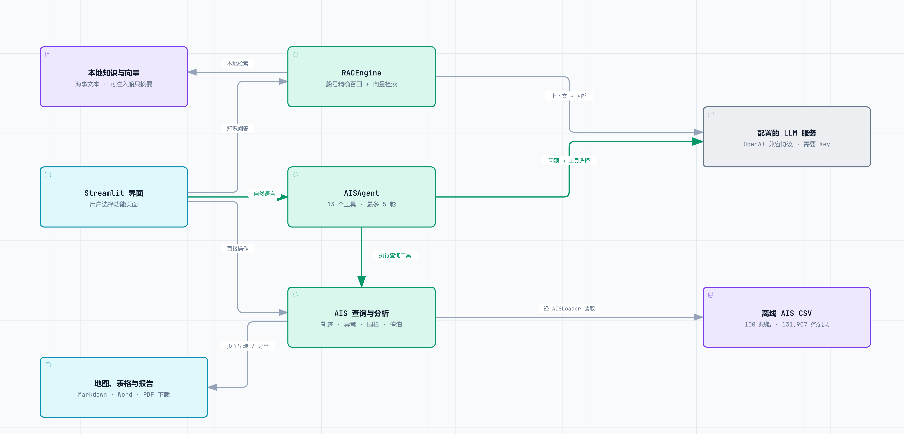
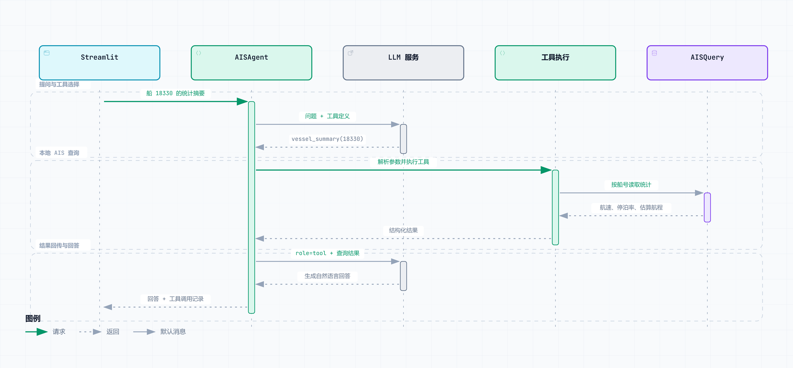

# Maritime VTS Knowledge Agent

[English](README.md) | **简体中文**

在一个 Streamlit Demo 中查看船舶轨迹、用自然语言查询 AIS 数据，并检索海事知识。

项目围绕 **100 艘船、131,907 条 CSV 记录**，连接本地 AIS 分析、海事知识库，以及能够调用数据工具的 Agent，适合学习、研究和演示 VTS（船舶交通服务）场景。

## 先选择你要做的事

| 你想做什么 | 界面入口 | 提供什么 | LLM API Key |
|---|---|---|---|
| 看轨迹、检查异常事件 | AIS 轨迹分析 | 地图、航速异常、围栏、停泊与航次 | 分析计算不需要 |
| 问某艘船或某个月的数据 | AIS 轨迹分析 → 自然语言查询 | 文字回答，可展开工具调用记录 | 需要 |
| 查 VTS、AIS 或海事概念 | 海事知识库问答 | 检索片段，可选 LLM 生成回答 | 仅检索时可不配置 |
| 汇总月度活动 | AIS 轨迹分析 → 月度报告 | 月度统计与 Markdown / Word / PDF 下载 | 不需要 |

## 各部分如何配合

用户先选择页面。知识问答、自然语言 AIS 查询和直接分析沿各自的路径执行。

<a href="docs/assets/overview.zh-CN.png">
<picture>
  <source media="(prefers-color-scheme: dark)" srcset="docs/assets/overview.zh-CN.dark.png">
  
</picture>
</a>

*点击图片查看大图。*

- **RAG：** 海事文本与可选船只摘要 → 船号精确召回与余弦相似度检索 → 来源片段；配置 Key 后可生成回答。
- **AIS Agent：** 问题 → LLM 选择工具 → 本地查询或分析 → 工具结果回传模型 → 回答与工具记录。
- **直接分析：** 页面控件 → 本地计算 → 地图和表格。报告页面组装月度结果并提供文档下载。

CSV 和向量索引在本地；配置 LLM 后，问题、检索片段及工具结果可能发送给该服务。地图底图使用外部瓦片服务。

## 跟踪一次船只查询

配置 LLM 后，进入 **AIS 轨迹分析 → 自然语言查询**，选择这个示例：

```text
船 18330 的统计摘要
```

一条代表路径是调用 `vessel_summary`，参数为 `{"vessel_id": 18330}`。实际工具由模型选择；下图根据源码绘制，并非一次真实 API 调用的留档。

<a href="docs/assets/agent-query.zh-CN.png">
<picture>
  <source media="(prefers-color-scheme: dark)" srcset="docs/assets/agent-query.zh-CN.dark.png">
  
</picture>
</a>

*点击图片查看大图。*

展开 **查看 AI 调用的工具**，可检查工具名称、参数和结果预览。地图与完整文档下载使用独立的分析页面。

Agent 注册了 **13 个工具，其中包含 `direct_answer`**，最多执行 5 轮 LLM 请求。首轮没有工具调用时会追加一次提示；后续仍可能返回无数据工具调用的文字，因此核对具体数值时应查看工具记录。

## 快速开始

使用 Python 3.10+，并创建虚拟环境。Windows 建议采用纯 ASCII 项目路径或模型缓存路径。

```text
git clone https://github.com/NaCr05/maritime-vts-agent.git
cd maritime-vts-agent
python -m venv .venv
```

<details>
<summary>Windows PowerShell</summary>

```powershell
.\.venv\Scripts\Activate.ps1
python -m pip install -r requirements.txt
Copy-Item .env.example .env
```

</details>

<details>
<summary>macOS / Linux</summary>

```bash
source .venv/bin/activate
python -m pip install -r requirements.txt
cp .env.example .env
```

</details>

要使用 AI 生成和自然语言 AIS 查询，按 [.env.example](.env.example) 填写 `.env`：

```dotenv
LLM_API_KEY=your-api-key
LLM_BASE_URL=https://api.deepseek.com/v1
LLM_MODEL=deepseek-chat
EMBEDDING_MODEL=paraphrase-multilingual-MiniLM-L12-v2
```

将 `LLM_API_KEY` 留空，可在初始化成功后直接进行 AIS 分析。自然语言 Agent 当前没有无 Key 的关键词查询降级。

```text
streamlit run app.py
```

默认本地地址为 `http://localhost:8501`。当前启动流程会先初始化 embedding 模型，再展示任何页面：即使不配置 LLM Key，首次启动仍可能需要下载模型。可通过 `VTS_HF_CACHE_DIR` 指定可写缓存目录；修改 `.env` 后需要重启 Streamlit。

首次体验直接分析，可进入 **AIS 轨迹分析 → 轨迹地图可视化**，选择船 `18330`。更多场景见仓库的 [Demo 检查清单](docs/demo_checklist.md)；清单中的步骤不代表当前版本已经验证通过。

## RAG 与分析细节

知识库采用 CPU 上的 `sentence-transformers` 和内存向量索引。侧边栏 **注入 AIS 数据到知识库** 会把船只摘要写入 `data/ais_knowledge/`，并重建索引；这些是生成时的快照，目前未接入实时 AIS。

RAG 合并船号精确匹配与向量结果。有检索结果时，海事关键词、已知船号或相似度阈值都可能选择 RAG 路径；否则由 LLM 回答，并标注为通用知识。无 Key 时，找到相关结果的查询可返回检索片段。

| 分析任务 | 方法 | 源码 |
|---|---|---|
| 航速异常 | 排除停泊段影响的 Z-score | [speed_anomaly.py](src/speed_anomaly.py) |
| 限制区域 | 矩形与圆形地理围栏 | [geo_fence.py](src/geo_fence.py) |
| 锚地 / 停泊聚类 | 使用 Haversine 距离的 DBSCAN | [stay_point_detection.py](src/stay_point_detection.py) |
| 航次识别 | 以持续低速区间作为分界 | [voyage_segmentation.py](src/voyage_segmentation.py) |

## 从哪里读代码

| 关注点 | 入口 |
|---|---|
| 导航与初始化 | [app.py](app.py)、[ui/ais_analysis_page.py](ui/ais_analysis_page.py) |
| LLM 工具循环 | [src/ais_agent.py](src/ais_agent.py) |
| RAG 与本地检索 | [src/rag_engine.py](src/rag_engine.py)、[src/vector_store.py](src/vector_store.py) |
| AIS 加载与统计 | [src/ais_loader.py](src/ais_loader.py)、[src/ais_query.py](src/ais_query.py) |
| 报告组装与导出 | [ui/report_page.py](ui/report_page.py)、[src/report_exporter.py](src/report_exporter.py) |

## 数据与适用范围

仓库中 100 个 CSV 对应船号 `18330–18429`，共 **131,907 条记录**，时间范围为 **2016-11-01 至 2020-11-01**。上述统计来自版本 `92312c4` 的实际文件。

加载器会统一船号、经纬度、对地航速、对地航向与时间戳字段。更换数据后，可以运行 `python -m src.scan_dataset` 刷新摘要。

## 测试

[6 项自动回归测试](docs/testing.md)覆盖 RAG 入口与无 Key 回答、月报和围栏入口、真实月度统计及 Markdown / Word / PDF 输出，以及无 Key 时的 Agent 提示。测试使用仓库 AIS 数据和实际导出器，以确定性检索替代 embedding 模型。

```text
python -m pip install -r requirements-test.txt
python -m pytest tests -q
```

这些检查不验证在线 LLM 回答、embedding 质量或首次模型下载。图稿维护方法见[图源与重新生成](docs/diagrams/README.md)。

## 当前限制

- 尚未接入实时 AIS、多智能体编排或量化的回答质量评估。
- 风险评分、围栏和异常参数属于 Demo 规则，不能视为实际海事处置结论。

## License

代码采用 [MIT License](LICENSE)。AIS 数据和海事文本片段用于学习、研究与演示，复用仍须遵循原始提供方的授权条款。
